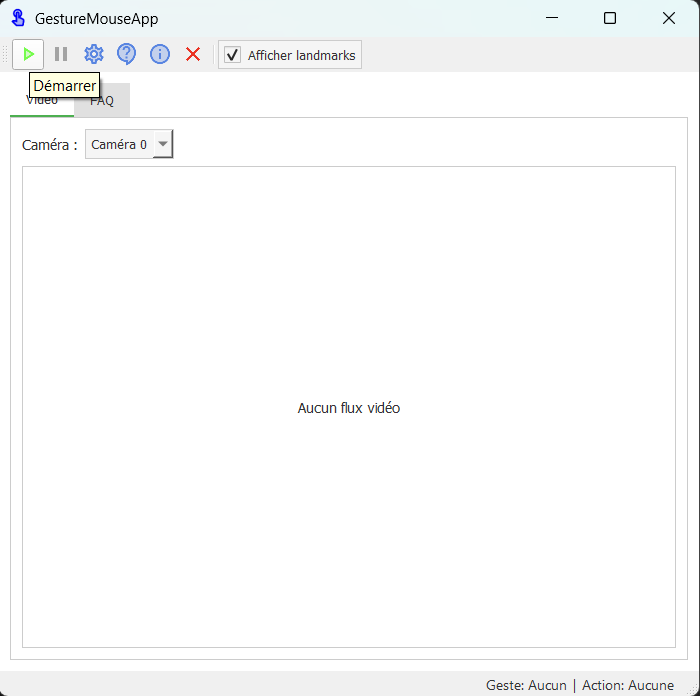
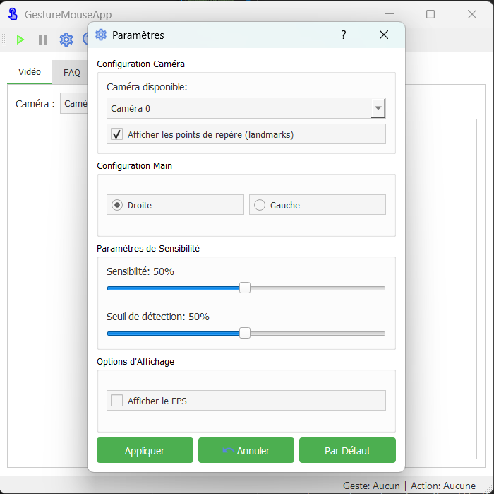
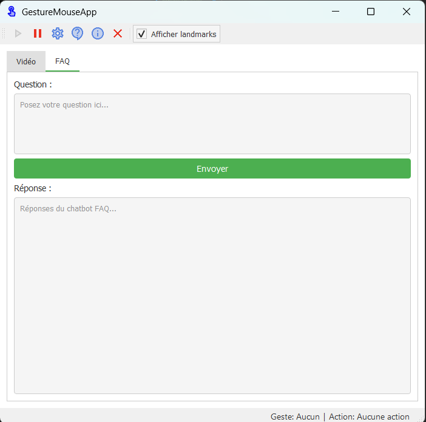

# GestureMouseApp - Contrôle Gestuel d'Interface

[](LICENSE)
[]()
[](https://python.org)
[](https://gesturemouseapp.readthedocs.io)

**Contrôlez votre ordinateur par gestes** - Une solution intuitive pour une interaction naturelle sans périphériques



## Fonctionnalités Clés ✨

- 🖱️ **Contrôle précis du curseur** par reconnaissance de gestes
- 👆 **Actions souris complètes** : clics, double-clics, clic droit, défilement
- 🔊 **Réglage du volume** par gestes de pincement
- 💡 **Contrôle de la luminosité** de l'écran
- ❓ **FAQ intelligente** avec chatbot intégré
- ⚙️ **Configuration personnalisable** des gestes et sensibilité
- 📊 **Visualisation en temps réel** des points de repère des mains

## Gestes supporté
| Geste                        | Action système                |
|------------------------------|-------------------------------|
| V de victoire (main ouverte) | Déplacement du curseur        |
| Poing fermé                  | Clic maintenu (drag)          |
| Index baissé                 | Clic gauche                   |
| Majeur baissé                | Clic droit                    |
| Deux doigts fermés           | Double-clic                   |
| Pincement majeur             | Volume/Luminosité             |
| Pincement mineur             | Défilement                    |

## Technologies Utilisées 🛠️

- **Langage principal**: Python 3.10+
- **Interface utilisateur**: PyQt5
- **Vision par ordinateur**: OpenCV + MediaPipe
- **Traitement NLP**: NLTK + scikit-learn
- **Contrôle système**: pyautogui + pycaw
- **Packaging**: PyInstaller
- **Documentation**: MkDocs + ReadTheDocs

## Installation et Utilisation 🚀

### Prérequis
- Webcam compatible
- Windows 10/11 (64-bit)
- [Microsoft Visual C++ Redistributable](https://aka.ms/vs/17/release/vc_redist.x64.exe)

### Installation
```bash
# 1. Cloner le dépôt
git clone https://github.com/Marc1T/gestureControl.git
cd gestureControl

# 2. Créer un environnement virtuel
python -m venv .venv
.\.venv\Scripts\activate

# 3. Installer les dépendances
pip install -r requirements.txt

# 4. Lancer l'application
python main.py
```

<!--### Télécharger l'exécutable
[](https://github.com/Marc1T/gestureControl/releases)
-->
## Démonstration 🎥

https://github.com/Marc1T/gestureControl/assets/123456789/demo-gesture-control

## Structure du Projet 📂

```
GestureMouseApp/
├── main.py                  # Point d'entrée de l'application
├── core/                    # Logique métier principale
│   ├── gesture_detection.py # Détection des mains et capture vidéo
│   ├── hand_recognition.py  # Reconnaissance des gestes spécifiques
│   └── gesture_controller.py# Exécution des actions système
├── interface/               # Interface utilisateur
│   ├── main_window.py       # Fenêtre principale
│   ├── video_thread.py      # Thread de traitement vidéo
│   ├── settings_dialog.py   # Dialogue des paramètres
│   └── about_dialog.py      # Dialogue "À propos"
├── utils/                   # Utilitaires
│   ├── config_manager.py    # Gestion de configuration
│   ├── logger.py            # Système de journalisation
│   └── helpers.py           # Fonctions utilitaires
├── chatbot/                 # Module FAQ
│   └── faq_bot.py           # Chatbot intelligent
├── config/                  # Fichiers de configuration
│   ├── settings.ini         # Paramètres généraux
│   ├── gestures.json        # Mapping gestes-actions
│   └── faq.json             # Base de connaissances FAQ
├── assets/                  # Ressources graphiques
│   ├── logo.png             # Logo de l'application
│   ├── play.png             # Icône de lecture
│   └── ...                  # Autres icônes
└── docs/                    # Documentation
```

## Captures d'Écran 📸

| Interface principale | Paramètres | FAQ |
|----------------------|------------|-----|
|  |  |  |

## Contribuer 🤝

Les contributions sont les bienvenues ! Voici comment procéder :

1. Forker le projet
2. Créer une branche (`git checkout -b feature/AmazingFeature`)
3. Commiter vos modifications (`git commit -m 'Add some AmazingFeature'`)
4. Pousser vers la branche (`git push origin feature/AmazingFeature`)
5. Ouvrir une Pull Request

### Normes de codage
- Respecter le style PEP8
- Documenter les nouvelles fonctions
- Ajouter des tests unitaires pour les nouvelles fonctionnalités

## Licence 📄

Ce projet est sous licence MIT - voir le fichier [LICENSE](LICENSE) pour plus de détails.

## Contact 📧

Pour toute question ou suggestion, contactez-moi :
- **Marc Thierry NANKOULI**
- Email: [nankoulithierry@gmail.com](mailto:nankoulithierry@gmail.com)
- GitHub: [@Marc1T](https://github.com/Marc1T)

---

**GestureMouseApp** © 2025 - Projet académique développé par:
 - NANKOULI Marc Thierry
 - ELFILALI Halima
 - CHAIBOU Abdoulaye  
[Documentation complète](https://docscv.readthedocs.io/fr/latest/) | <!--[Rapport technique](docs/report.pdf) | [Présentation](docs/presentation.pptx) -->


